## 📦 Repositorio del proyecto

### 👉 https://github.com/Samuel-Tabares/practica-docker-ingenieria

Todo el código, los Dockerfiles y las evidencias de esta práctica están publicados en el repositorio de GitHub anterior.

---

# Evidencias — Práctica de Docker (Puntos 4 y 7)

> **Punto 4:** Ejercicio Práctico Principal — Cálculo de Potencia (Python y Java).
> **Punto 7:** Actividades para el Estudiante (preguntas de análisis, experimentación y retos).

**Estudiante:** Samuel Tabares
**Fecha:** 18 de junio de 2026
**Entorno:** macOS (Apple Silicon M1) · Docker Desktop · Docker `29.4.1`

> Este documento recoge, paso a paso, la evidencia de la realización del **Punto 4** de la práctica:
> construir y ejecutar dentro de contenedores Docker una *Calculadora de Potencia* ($P = b^{e}$),
> en sus dos implementaciones: **Python** y **Java**.

---

## 0. Verificación previa de Docker

Antes de empezar, confirmamos que el cliente de Docker está disponible y el daemon corriendo.

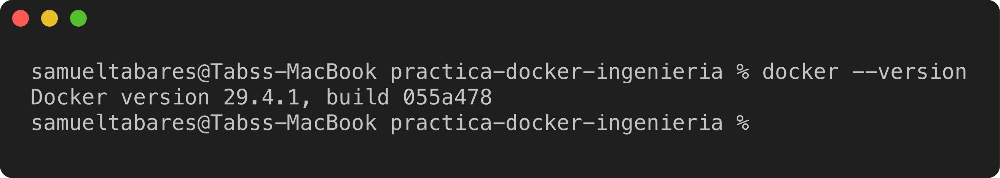

✅ Docker responde correctamente.

---

## Parte A — Implementación en Python

### Paso A.1 — Crear la carpeta y los archivos

Creamos la carpeta `docker-python` con dos archivos: el código fuente `app.py` y el `Dockerfile`.

**`app.py`** — lee la base y el exponente, valida y calcula la potencia:

```python
import sys

def calcular_potencia():
    print("=== CALCULADORA DE POTENCIA EN DOCKER (PYTHON) ===")
    try:
        base = float(input("Ingrese la base (b): "))
        exponente = int(input("Ingrese el exponente entero (e): "))

        if exponente < 0:
            print("Error: El exponente debe ser un entero no negativo.")
            return

        resultado = base ** exponente
        print(f"\nResultado Exitoso: {base} elevado a la {exponente} es = {resultado}")
    except ValueError:
        print("Error: Entrada inválida. Asegúrese de ingresar números válidos.")

if __name__ == "__main__":
    calcular_potencia()
```

**`Dockerfile`** — empaqueta la app sobre una imagen ligera de Python:

```dockerfile
# 1. Imagen base oficial de Python ligera
FROM python:3.10-slim

# 2. Establecer el directorio de trabajo dentro del contenedor
WORKDIR /usr/src/app

# 3. Copiar el archivo de código fuente al contenedor
COPY app.py .

# 4. Comando por defecto para ejecutar la aplicación al arrancar
CMD ["python", "app.py"]
```

### Paso A.2 — Construir la imagen

Con `docker build` Docker lee el `Dockerfile`, descarga la imagen base `python:3.10-slim` y crea nuestra imagen `potencia-py`.

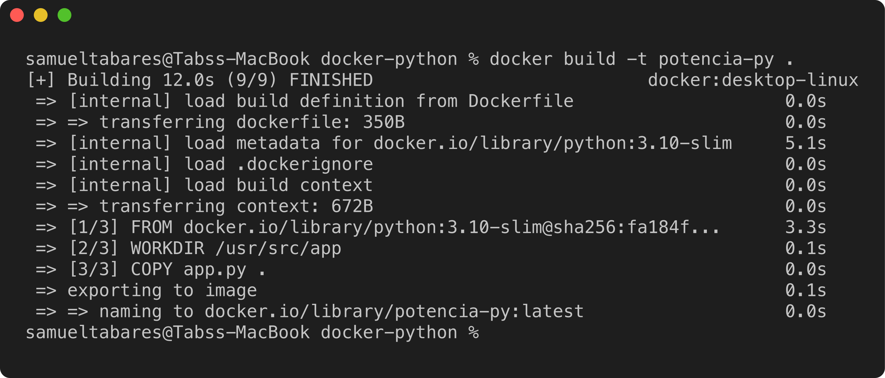

✅ Imagen `potencia-py:latest` creada.

### Paso A.3 — Ejecutar el contenedor (interactivo)

El flag `-it` es **obligatorio** porque la app pide datos por teclado.
Ingresamos `base = 5` y `exponente = 3`.

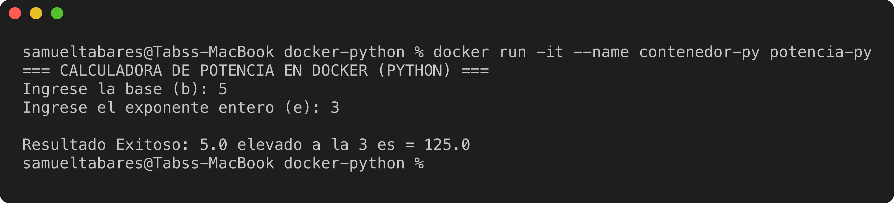

✅ El cálculo $5^{3} = 125$ es correcto.

### Paso A.4 — Verificar imagen y contenedor

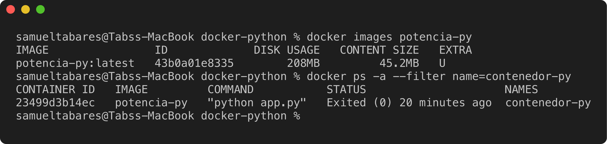

> 📸 La evidencia visual en Docker Desktop (imágenes y contenedores) se muestra consolidada en la
> sección *“Evidencia visual en Docker Desktop”* al final del documento.

---

## Parte B — Implementación en Java

### Paso B.1 — Crear la carpeta y los archivos

Creamos una carpeta independiente `docker-java` con `Potencia.java` y su `Dockerfile`.

**`Potencia.java`** — usa `Scanner` para leer entrada y `Math.pow` para el cálculo:

```java
import java.util.Scanner;

public class Potencia {
    public static void main(String[] args) {
        Scanner scanner = new Scanner(System.in);
        System.out.println("=== CALCULADORA DE POTENCIA EN DOCKER (JAVA) ===");

        try {
            System.out.print("Ingrese la base (b): ");
            double base = scanner.nextDouble();

            System.out.print("Ingrese el exponente entero (e): ");
            int exponente = scanner.nextInt();

            if (exponente < 0) {
                System.out.println("Error: El exponente debe ser no negativo.");
                return;
            }

            double resultado = Math.pow(base, exponente);
            System.out.printf("\nResultado Exitoso: %.2f elevado a la %d es = %.2f\n", base, exponente, resultado);

        } catch (Exception e) {
            System.out.println("Error: Entrada inválida. Intente de nuevo.");
        } finally {
            scanner.close();
        }
    }
}
```

**`Dockerfile`** — compila y ejecuta el `.java` dentro del contenedor:

```dockerfile
# 1. Imagen base que incluye el JDK para compilar y ejecutar
# Nota: openjdk:17-slim fue descontinuada en Docker Hub; usamos el reemplazo oficial (Adoptium Temurin).
FROM eclipse-temurin:17-jdk

# 2. Directorio dentro del contenedor
WORKDIR /app

# 3. Copiar el código fuente de la máquina host
COPY Potencia.java .

# 4. Compilar el archivo Java para generar el bytecode (.class)
RUN javac Potencia.java

# 5. Ejecutar la clase compilada al iniciar el contenedor
CMD ["java", "Potencia"]
```

> ⚠️ **Nota técnica importante.** La guía indica `FROM openjdk:17-slim`, pero esa imagen **fue descontinuada y
> retirada de Docker Hub** (el repositorio oficial `openjdk` ya no se mantiene). Al construir con ella, Docker falla
> con `openjdk:17-slim: not found` (ver evidencia en el paso B.2). La solución correcta es usar la imagen oficial
> de reemplazo recomendada por la comunidad de Java: **`eclipse-temurin:17-jdk`** (proyecto Adoptium).

### Paso B.2 — Construir la imagen

**Primer intento (siguiendo la guía con `openjdk:17-slim`):** la construcción falla porque la imagen ya no existe.

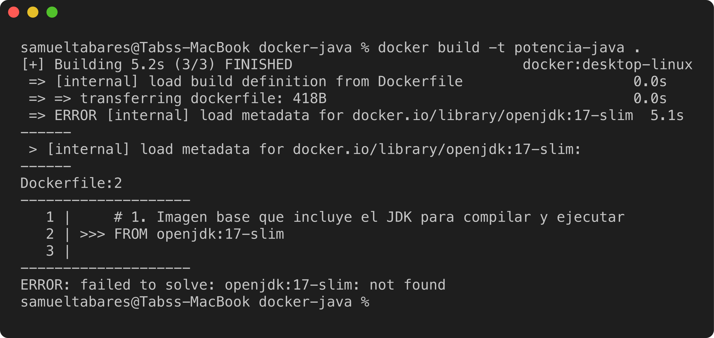

**Segundo intento (con `eclipse-temurin:17-jdk`):** ahora sí construye. A diferencia de Python, aquí el `Dockerfile`
incluye un paso `RUN javac` que **compila** el código durante la construcción de la imagen.

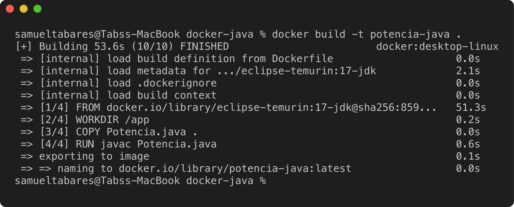

✅ Imagen `potencia-java:latest` creada (incluye el bytecode `Potencia.class` ya compilado).

### Paso B.3 — Ejecutar el contenedor (interactivo)

Ingresamos `base = 2` y `exponente = 8`.

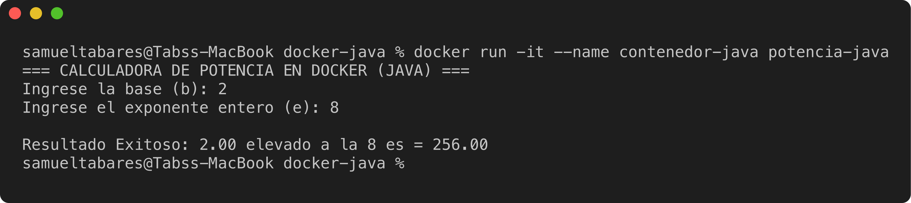

✅ El cálculo $2^{8} = 256$ es correcto.

> Nota: la guía muestra el resultado con coma decimal (`2,00 ... 256,00`) porque su autor usaba configuración regional
> en español. Dentro del contenedor la configuración regional es neutra (`C`), por eso se muestra con punto
> (`2.00 ... 256.00`). El valor numérico es el mismo.

### Paso B.4 — Verificar imagen y contenedor

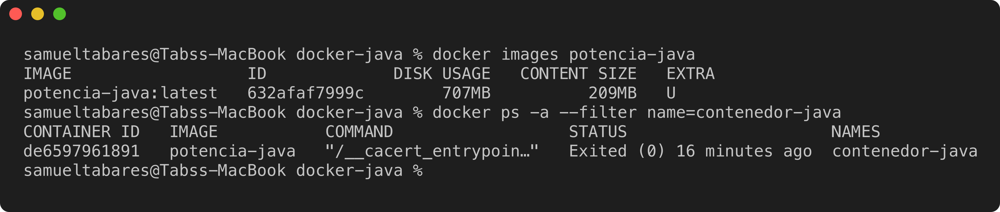

---

## Evidencia visual en Docker Desktop

**Sección Images** — se observan las dos imágenes construidas en este ejercicio, `potencia-py` (208 MB) y `potencia-java` (707 MB):

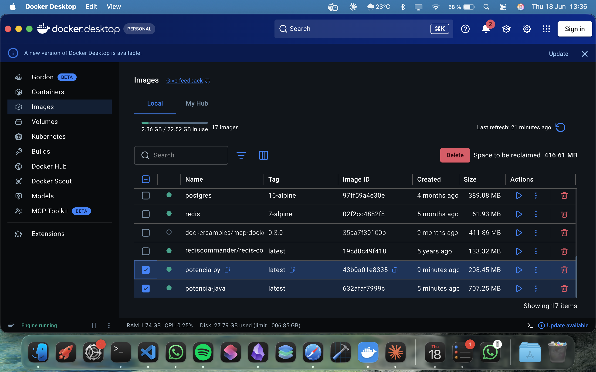

**Sección Containers** — se observan los dos contenedores ejecutados, `contenedor-py` y `contenedor-java`:

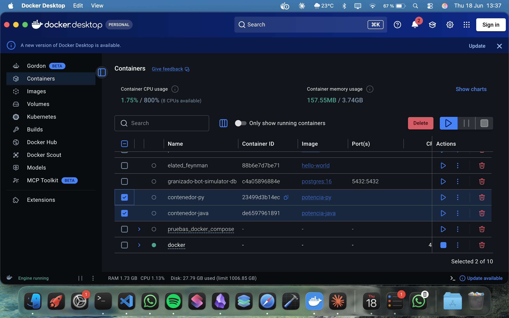

---

## Resumen de evidencias

| Implementación | Imagen          | Tamaño | Contenedor        | Cálculo probado     | Resultado |
|----------------|-----------------|--------|-------------------|---------------------|-----------|
| Python         | `potencia-py`   | 208 MB | `contenedor-py`   | $5^{3}$             | `125.0`   |
| Java           | `potencia-java` | 707 MB | `contenedor-java` | $2^{8}$             | `256.00`  |

### Conclusiones

- Se completó el **ciclo Docker** en ambos lenguajes: *escribir código → Dockerfile → `build` → `run`*.
- Los contenedores quedan en estado `Exited (0)` (salida exitosa) tras terminar; siguen almacenados hasta eliminarlos con `docker rm`.
- La imagen de **Java pesa mucho más** (707 MB vs 208 MB) porque incluye el JDK completo para compilar; la de Python solo el intérprete sobre una base `slim`.
- El flag `-it` fue indispensable: sin él, la app no podría leer la base y el exponente desde el teclado.
- Se documentó y resolvió un problema real del entorno: la imagen `openjdk:17-slim` de la guía ya no existe en Docker Hub.

---

# Punto 7 — Actividades para el Estudiante

## Preguntas de Análisis

### 1. ¿Qué sucede con el archivo `.class` generado en la compilación de Java cuando el contenedor se detiene y destruye?

**Respuesta:** En este ejercicio, **no se pierde**. La clave está en *cuándo* se genera el `.class`:
nuestro `Dockerfile` lo compila con `RUN javac Potencia.java` **durante la construcción de la imagen** (`docker build`),
así que `Potencia.class` queda grabado dentro de una **capa de solo lectura de la imagen**, no en el contenedor.

Por eso, aunque detengamos y destruyamos el contenedor (`docker rm`), la imagen sigue conteniendo el `.class`.
Lo comprobamos sobrescribiendo el comando de arranque por un `ls` para listar el contenido de `/app`:

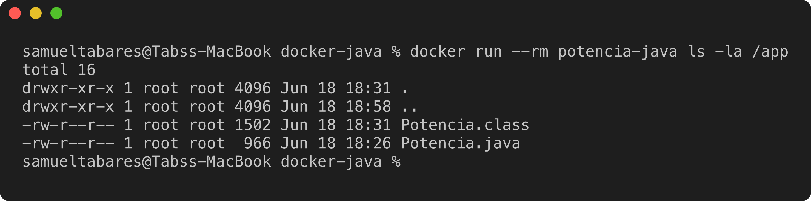

> ⚠️ Matiz importante: si la compilación se hiciera **en tiempo de ejecución** (dentro del contenedor, no en el `build`),
> el `.class` viviría en la **capa de escritura del contenedor** y **sí se perdería** al destruirlo. La persistencia real
> de datos se logra con **volúmenes**.

### 2. Si ejecuta `docker run` sin el parámetro `-it`, ¿qué comportamiento observa y por qué?

**Respuesta:** El programa imprime el encabezado, muestra el primer prompt y **falla inmediatamente** con `EOFError`.
Sin `-i` no se conecta la entrada estándar (`stdin`) y sin `-t` no hay terminal: cuando `input()` intenta leer, recibe
un fin de archivo (EOF) de inmediato, porque no hay nadie escribiendo.

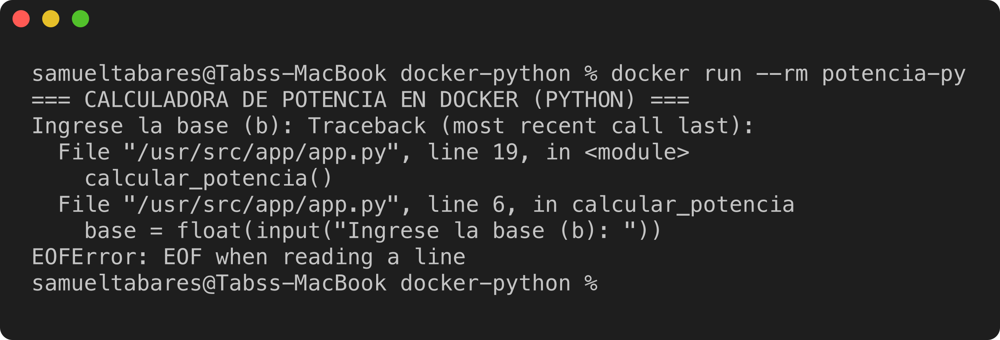

> En Java el efecto equivalente es una excepción `NoSuchElementException` del `Scanner`. La conclusión es la misma:
> las apps interactivas requieren `-it` para recibir datos del teclado.

---

## Actividades de Experimentación

### 1. `docker ps -a` — ¿cuántos contenedores permanecen almacenados?

En este equipo permanecen **15 contenedores** almacenados en disco (en cualquier estado). La mayoría están `Exited`
(detenidos pero no eliminados): siguen ocupando espacio hasta borrarlos con `docker rm`.

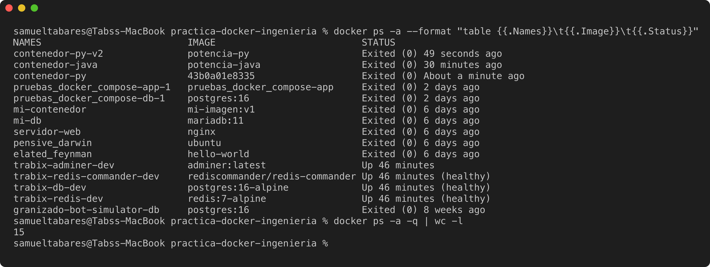

### 2. `docker inspect` — IP interna del contenedor de Python

La dirección IP interna **solo existe mientras el contenedor está en ejecución**. Como la calculadora termina apenas
da el resultado, `contenedor-py` está `exited` y **no tiene IP**. Para evidenciar la IP, levantamos un contenedor de la
misma imagen manteniéndolo vivo (`sleep`) y lo inspeccionamos: la IP interna asignada por la red `bridge` es **`172.17.0.2`**.

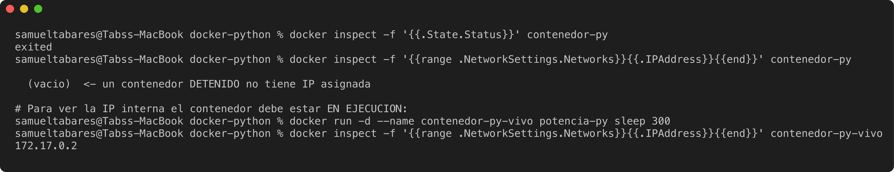

---

## Retos de Dificultad Media

### 1. Modificación del código — ciclo `while True`

Modificamos `app.py` para que, tras cada resultado, pregunte si se desea otro cálculo o terminar escribiendo `salir`
(la versión original se conservó en `docker-python/app_original.py`):

```python
def calcular_potencia():
    try:
        base = float(input("Ingrese la base (b): "))
        exponente = int(input("Ingrese el exponente entero (e): "))

        if exponente < 0:
            print("Error: El exponente debe ser un entero no negativo.")
            return

        resultado = base ** exponente
        print(f"Resultado Exitoso: {base} elevado a la {exponente} es = {resultado}")
    except ValueError:
        print("Error: Entrada inválida. Asegúrese de ingresar números válidos.")

def main():
    print("=== CALCULADORA DE POTENCIA EN DOCKER (PYTHON v2) ===")
    while True:
        calcular_potencia()
        opcion = input("\n¿Desea realizar otro cálculo? (Enter = sí / 'salir' = terminar): ").strip().lower()
        if opcion == "salir":
            print("Saliendo de la calculadora. ¡Hasta luego!")
            break
        print()

if __name__ == "__main__":
    main()
```

### 2. Actualización de imagen — ¿`docker start -i contenedor-py` refleja los cambios?

**No.** Un contenedor es una instancia *congelada* de la imagen con la que se creó. `docker start` vuelve a arrancar
ese mismo contenedor con su filesystem original, así que sigue ejecutando el **código viejo** (encabezado `PYTHON`,
un solo cálculo), aunque ya hayamos editado `app.py` en el host:

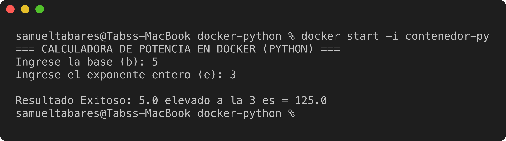

**Procedimiento correcto para actualizar una app contenerizada:** reconstruir la imagen (`docker build`) para que copie
el nuevo `app.py`, y luego **crear un contenedor nuevo** (`docker run`) a partir de la imagen actualizada. Ahí sí aparece
el comportamiento nuevo (encabezado `PYTHON v2` y el ciclo `while True`):

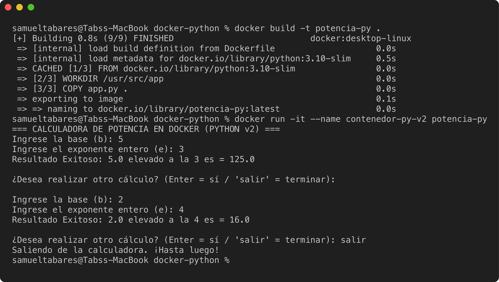

> Resumen del ciclo de actualización: **editar código → `docker build` (nueva imagen) → `docker run` (nuevo contenedor)**.
> Editar el código del host *no* afecta a imágenes ni contenedores ya creados.

---

### Conclusiones del Punto 7

- El `.class` de Java persiste porque se compila en el `build` (queda en la imagen), no en el contenedor.
- Sin `-it`, las apps interactivas fallan por falta de `stdin` (EOF).
- Los contenedores detenidos siguen ocupando disco hasta `docker rm`; su IP solo existe mientras corren.
- Actualizar una app contenerizada exige **reconstruir la imagen y recrear el contenedor**, no reiniciar el viejo.
